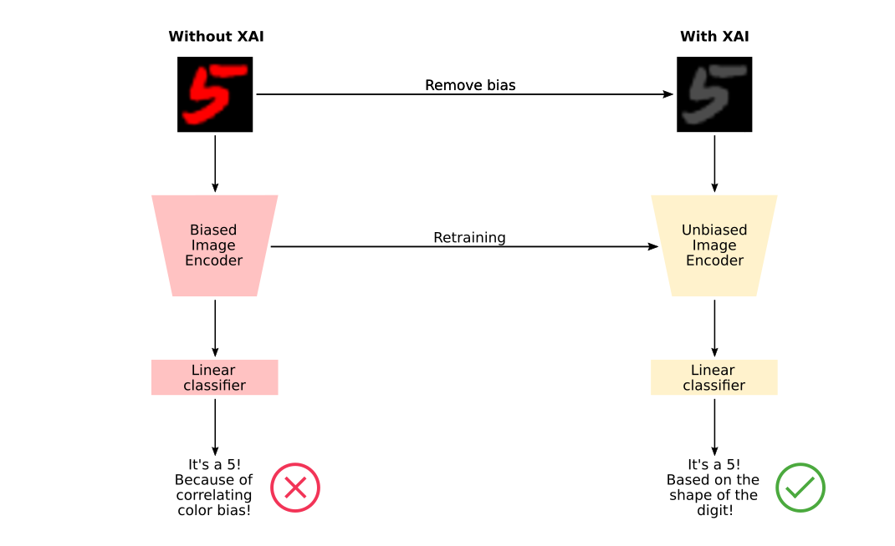
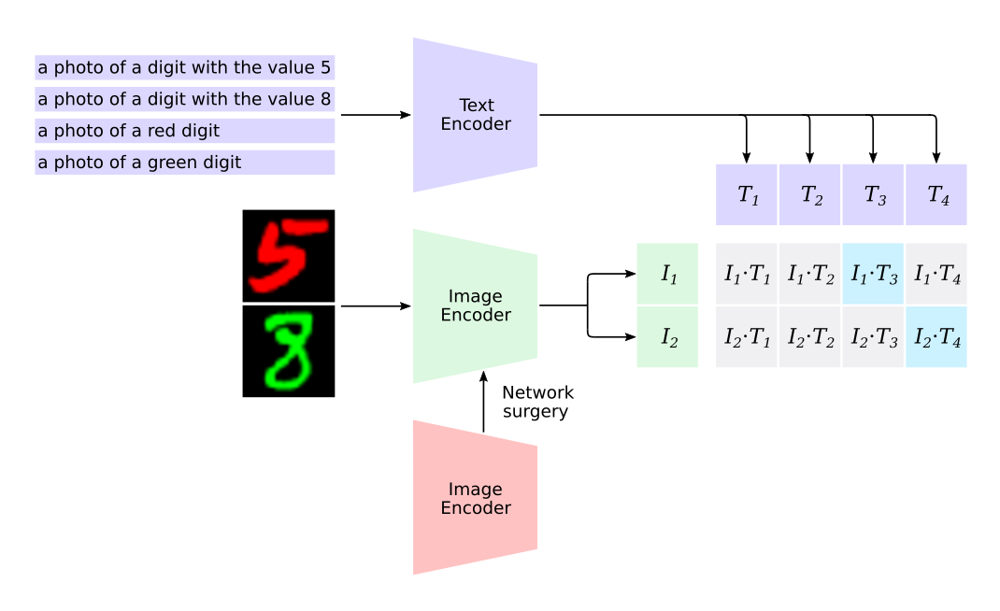

# 🧠 Caption-Driven Explainability: Probing CNNs for Bias via CLIP

[](https://arxiv.org/abs/2510.22035)
[]()
[](LICENSE)
[](https://scholar.google.com/citations?user=w1QXiQkAAAAJ)

> Multimodal explainable AI framework combining CLIP and CNNs to reveal concept-level bias and interpretability in deep vision models.

> **Official Implementation of “Caption-Driven Explainability: Probing CNNs for Bias via CLIP”**  
> [Patrick Koller](https://scholar.google.com/citations?user=w1QXiQkAAAAJ)¹,  
> [Amil V. Dravid](https://scholar.google.com/citations?hl=de&user=YZ8Y-sUAAAAJ)²,  
> [Guido M. Schuster](https://scholar.google.com/citations?user=_A1-3vMAAAAJ&hl=de&oi=ao)³,  
> [Aggelos K. Katsaggelos](https://scholar.google.com/citations?user=aucB85kAAAAJ&hl=en)¹  
> ¹Northwestern University | ²UC Berkeley | ³Eastern Switzerland University of Applied Sciences  
> 🏔️ Presented at **IEEE ICIP 2025**, Anchorage (Alaska)

---

## 🚀 Overview

Deep neural networks have transformed computer vision, achieving remarkable accuracy in recognition, detection, and classification tasks.  
However, understanding *why* a network makes a specific decision remains one of the central challenges in AI.  
This repository introduces a **multimodal explainable AI (XAI)** framework that bridges **vision and language** using **OpenAI's CLIP**.  
Through a process called **network surgery**, it reveals the semantic concepts driving model predictions and exposes hidden **biases** within learned representations.

💡 Unlike pixel-based saliency methods, our approach:
- Explains *what concept* drives a prediction, not just *where* the model looked  
- Identifies **spurious correlations** such as color or texture bias  
- Provides **quantitative insight** into robustness and covariate shift  

<p align="center">
  <br>
  <em>Conceptual overview: bridging CLIP and a standalone model to uncover the semantics behind decisions.</em>
</p>

---

## 🧩 Core Idea

We integrate a **standalone model to be explained** (for example ResNet-50) into **CLIP** by aligning their activation maps.  
CLIP’s text encoder then serves as a semantic probe, describing *what* the model has truly learned.

### 🔍 Key Components
1. **Network surgery** – Swap correlated activation maps between the standalone model and CLIP  
2. **Activation matching** – Compute cross-layer correlations to identify equivalent feature spaces  
3. **Caption-based inference** – Use natural-language captions (e.g. “red digit”, “green digit”, “round shape”) to interpret dominant concepts  

<p align="center">
  <br>
  <em>Activation matching aligns internal feature spaces for interpretable concept fusion.</em>
</p>

---

## ⚖️ Grad-CAM vs. Caption-Driven XAI

Both **Grad-CAM** and **Caption-Driven XAI** offer valuable insights, but they answer different questions.

| Method | Explains | Handles overlapping features | Quantitative concept analysis | Human-readable output |
|:--|:--|:--|:--|:--|
| **Grad-CAM** | Spatial importance (*where*) | ❌ | ❌ | ❌ |
| **Caption-Driven XAI** | Conceptual semantics (*what*) | ✅ | ✅ | ✅ |

Grad-CAM highlights the *region* of attention, while Caption-Driven XAI uncovers the *reason*, bridging visual focus with linguistic meaning.  
*Quantitative concept analysis refers to measuring how strongly each linguistic concept (e.g. “red”, “round”) influences a model’s prediction, based on similarity in CLIP’s multimodal embedding space.*

---

## 📚 Citation

If you use this repository, please cite:

```bibtex
@inproceedings{koller2025captionxai,
  title={Caption-Driven Explainability: Probing CNNs for Bias via CLIP},
  author={Koller, Patrick and Dravid, Amil V. and Schuster, Guido M. and Katsaggelos, Aggelos K.},
  booktitle={IEEE International Conference on Image Processing (ICIP)},
  year={2025},
  organization={IEEE}
}
```


## 🌐 Links

- 📄 Read the full paper (arXiv preprint): https://arxiv.org/abs/2510.22035  
- 🧠 Personal website: https://patch0816.github.io/  
- 🧾 Google Scholar: https://scholar.google.com/citations?user=w1QXiQkAAAAJ  
- 💬 Contact the author: mailto:patrickkoller2028@u.northwestern.edu  


## ❤️ Acknowledgments

This research was conducted at the [AIM-IVPL Lab](https://sites.northwestern.edu/ivpl/) (Northwestern University),  
in collaboration with [UC Berkeley](https://www.berkeley.edu/) and [OST/ICAI Switzerland](https://www.ost.ch/de/forschung-und-dienstleistungen/interdisziplinaere-themen/icai-interdisciplinary-center-for-artificial-intelligence).

---
*Keywords:* Explainable AI, CLIP, Computer Vision, Bias, Robustness, Interpretability, Multimodal Learning, Northwestern University, ICIP 2025
---
